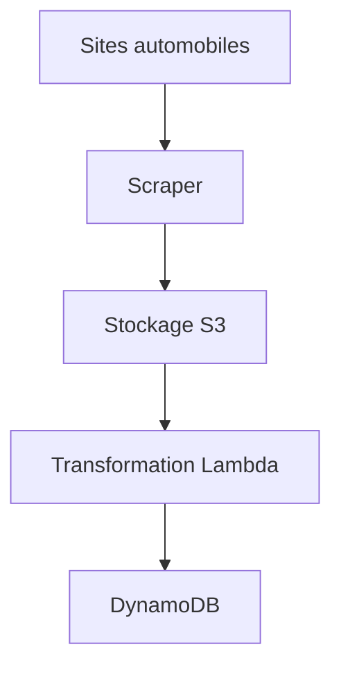
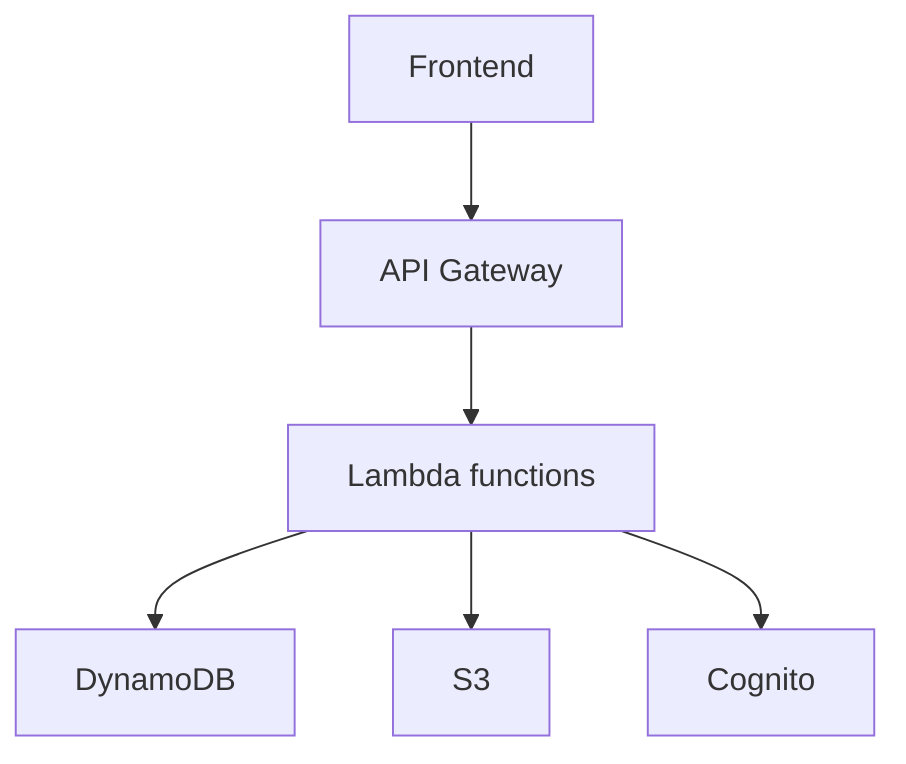

# Eval

## Table des matières

1. [Présentation](#présentation)
2. [Installation](#installation)
3. [Utilisation](#utilisation)
4. [Architecture](#architecture)
5. [Technologies](#technologies)
6. [Tests](#tests) 
7. [Contribution](#contribution)
8. [License](#license)

## Présentation

Eval est une application web développée pour automatiser et optimiser le processus d'analyse et de tarification des véhicules d'occasion en vue de leur revente. 

Le projet est né d'un besoin identifié chez les professionnels du secteur automobile, pour qui une grande partie du travail consiste à recevoir, analyser et établir manuellement le prix de véhicules à partir de fichiers structurés et semi-structurés. Ce processus fastidieux et chronophage est un frein à l'optimisation de leur activité.

Eval apporte une solution innovante à cette problématique en s'appuyant sur des compétences en ingénierie et science des données. L'application est capable de collecter automatiquement un grand nombre d'annonces de véhicules chaque jour en scraping les sites spécialisés. Ces données sont ensuite nettoyées, transformées et injectées dans des modèles d'apprentissage automatique développés spécifiquement pour cette application.

Les algorithmes de machine learning analysent les caractéristiques de chaque véhicule et calculent un prix de revente optimal ainsi qu'une fourchette de prix prédite.

L'application présente une interface utilisateur moderne permettant aux professionnels de spécifier des critères de recherche et d'obtenir en quelques secondes des recommandations de tarification sur les véhicules correspondants.

Conçue à l'aide des dernières technologies web comme Vue.js et TailwindCSS, et s'appuyant sur une architecture serverless sur AWS, Eval est une solution puissante et innovante pour accompagner la transition numérique du secteur automobile.

En automatisant une partie fastidieuse du travail et en exploitant la puissance des données, Eval optimise les processus des professionnels du secteur et leur fait gagner un temps précieux tout en améliorant la précision des estimations.

## Installation

L'application Eval comprend 2 parties principales :

- Le frontend Vue.js 
- Le backend serverless déployé sur AWS

### Frontend

Le code source du frontend est disponible sur GitHub. Pour installer et lancer l'application frontend en local :

- Cloner le dépôt GitHub
- Exécuter `npm install` pour installer les dépendances 
- Exécuter `amplify pull`pour installer les dépendances amplify (Partie Backend à installer avant)
- Exécuter `npm run dev` pour démarrer le serveur de développement
- Rendez-vous sur `http://localhost:5173` 

### Backend

Le backend étant hébergé sur AWS, il nécessite quelques manipulations pour le déployer :

- Installer l'AWS CLI et configurer les accès
- Installer le SDK Serverless Framework
- Copier le code source backend dans un répertoire local
- Exécuter `serverless deploy` pour déployer le backend

Cette commande va automatiquement provisionner les services AWS nécessaires :

- Lambda functions
- DynamoDB tables
- AppSync API
- etc.

Une fois le déploiement terminé, l'URL de l'API GraphQL AppSync sera affichée et pourra être configurée dans le frontend.

## Utilisation

Cette section explique comment utiliser les principales fonctionnalités de l'application Eval une fois installée.

### Navigation

- La page d'accueil présente les fonctionnalités clés et le menu de navigation principal
- La barre de navigation en haut permet d'accéder aux différentes sections
- Le formulaire de connexion se trouve en haut à droite

### Connexion

- La connexion se fait soit par email/mot de passe soit via Google/Facebook
- Un nouvel utilisateur doit au préalable créer un compte
- Une fois connecté, l'utilisateur accède à son tableau de bord personnel

### Recherche et évaluation de véhicule

- Depuis le tableau de bord, l'utilisateur accède au formulaire de recherche 
- Il peut définir différents critères comme la marque, le modèle, le kilométrage, etc.
- En soumettant la recherche, l'application calcule et affiche les estimations de prix
- L'utilisateur peut sauvegarder les résultats ou relancer une recherche

### Profil et historique

- Via le menu, l'utilisateur accède à la page de son profil
- Celle-ci résume ses informations personnelles et son activité
- L'onglet Historique liste toutes ses recherches passées

### Administration

- Les administrateurs ont accès à des fonctionnalités avancées
- Ils peuvent gérer les utilisateurs, les données système, les modèles de ML, etc.
- L'interface d'administration se trouve sous /admin

## Architecture 

L'architecture technique de l'application Eval est organisée en trois parties :

### Collecte de données

La collecte de données est un élément clé du fonctionnement d'Eval, permettant d'alimenter les modèles d'apprentissage automatique.

Les étapes principales sont:

- **Scraping** : un scraper développé en Python extrait quotidiennement les annonces depuis des sites automobiles comme Leboncoin.

- **Stockage** : les données scrapées sont stockées dans Amazon S3 dans un bucket dédié.

- **Transformation** : les données brutes sont transformées et enrichies à l'aide de scripts Python et de fonctions AWS Lambda.

- **Chargement** : les données transformées sont chargées dans la base de données Amazon DynamoDB pour être exploitées par l'application.

Cette architecture permet de collecter des milliers d'annonces par jour et de maintenir les données à jour pour fournir des estimations précises.

Des outils comme AWS Batch, Docker et Github Actions sont utilisés pour orchestrer et automatiser ces traitements de données.

### Backend applicatif

Le backend de l'application Eval est développé avec une architecture serverless sur AWS.

Les composants principaux sont:

- **AWS Lambda** : exécution du code métier sous forme de fonctions serverless déclenchées par les appels API 
- **Amazon DynamoDB** : base de données NoSQL pour stocker les données applicatives comme les profils utilisateurs 
- **Amazon S3** : stockage des données et fichiers statiques comme les rapports générés 
- **AWS AppSync** : API GraphQL pour permettre au frontend d'accéder aux données 
- **AWS Cognito** : service de gestion des utilisateurs et de l'authentification 
- **API Gateway** : point d'entrée pour les requêtes HTTP vers les Lambda functions backend 

Cette architecture serverless permet une grande flexibilité et une mise à l'échelle automatique en fonction de la charge. 

### Frontend applicatif

Le frontend de Eval est développé avec Vue.js et communique avec le backend via l'API GraphQL.

L'interface utilisateur est construite à l'aide de composants Vue.js pour le routage, l'affichage des données, les formulaires, etc.

Les principales technologies sont :

- **Vue.js** : framework Javascript pour développer l'interface utilisateur sous forme de components
- **Vue Router** : gestion du routage et de la navigation dans l'application
- **Pinia** : gestion des états et partage de données entre composants
- **Tailwind CSS** : utilitaires CSS pour le styling et la mise en page
- **API GraphQL** : pour récupérer les données depuis le backend AWS et mettre à jour l'interface. 

Cette architecture frontend permet une évolution rapide de l'interface utilisateur et une grande modularité grâce à la decomposition en composants.

L'application Eval repose sur un ensemble de technologies open source pour le frontend, le backend et la data science.

### Frontend

- Vue.js
- Vue Router
- Pinia
- Tailwind CSS

### Backend

- AWS Lambda
- Amazon DynamoDB
- Amazon S3
- AWS AppSync
- AWS Cognito
- Serverless Framework

### Data science

- Pandas
- Scikit-learn
- XGBoostRegressor
- Aiottp
- BeautifulSoup

### Infrastructure

- Docker
- AWS Fargate
- AWS Batch
- GitHub Actions

### Tests

- Jest
- Test-utils

## Développement

- JavaScript
- Python
- Node.js
- Git/GitHub

## License

Ce projet est sous licence MIT. Vous êtes libre de copier, modifier, et redistribuer le code source sous les termes de cette licence. Vous pouvez trouver plus d'informations sur la licence MIT dans le fichier `LICENSE.md` inclus dans ce dépôt.

Pour toute utilisation qui n'est pas couverte par cette licence, veuillez nous contacter à julien.nataf@gmail.com .
